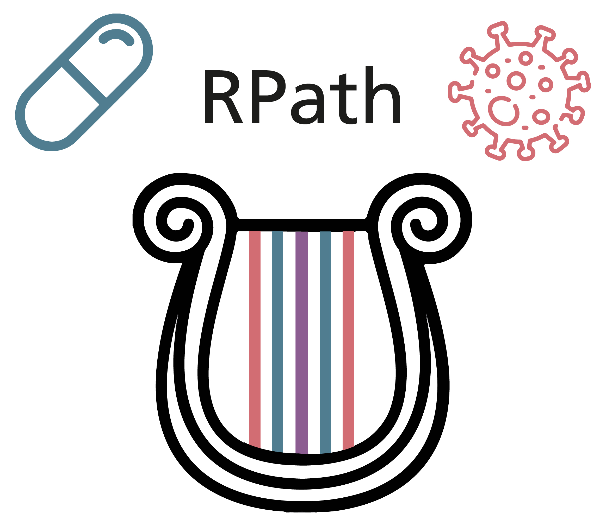

# RPath

  

Source code and data presented in "Causal reasoning over knowledge graphs leveraging drug-perturbed and disease-specific transcriptomic signatures for drug discovery".

## Structure

- `data`: contains the four transcriptomic datasets used in the paper as well as the two KGs. Furthermore, it contains the drug-disease pairs studied in clinical trials which are used as positive pairs for the validation of the RPath algorithm.
- `notebooks`: contains the code to run the algorithm and its validation as well as its analysis. 

## Dataset

Datasets are publically available and can be directly downloaded from 

## How to use the model?

1. Data requirements:
   1. Knowledge graphs - You would need a TSV file indicating the triple information with columns: source, target, and polarity as shown [here](data/kg/custom_filtered_kg.tsv)
   2. Transcriptomic data - You need to have the data in form of a python dictionary such that the key is the gene name or identifier and value is +1, -1, or 0 based on whether the gene is under- or over-expressed. Here, we make use of a dictionary of dictionary where the key for the outer  dictionary is the chemical or disease causing the effect and the inner dictionary is the gene identifier and its expression value as shown [here](data/transcriptomics/creed_harmonized_expression.json).
2. Model usage:
   1. We first load the data sets mentioned above i.e. the knowledge graph and the transcriptomic data (Cell #3 and #4 from [notebook](notebooks/4.0-subgraph_full_analysis.ipynb))
   2. Ensure that the transcriptomic datasets contains entries that are in your knowledge graph (Cell #5 from [notebook](notebooks/4.0-subgraph_full_analysis.ipynb))
   3. Call the `get_validated_paths()` method and pass the following arguments:
      1. directed graph = knowledge graph.
      2. source = source node (here chemical node).
      3. target = target node (here disease node).
      4. all paths = list of all paths between the source and target node. Ensure that the path list contains only the nodes and no relation information
      5. drug_dict = Dictionary of the transcriptomic data for the drug/source of interest.
      6. disease_dict = Dictionary of the transcriptomic data for the disease/target of interest.
   
   (Cell #8 from [notebook](notebooks/4.0-subgraph_full_analysis.ipynb))

The overall model usage example is shown in [notebook 4](notebooks/4.0-subgraph_full_analysis.ipynb)

## Citation
If you have found RPath useful in your work, please consider citing:

Domingo-Fernandez, D., Gadiya, Y., Patel, A., Mubeen, S., Rivas-Barragan, D., Diana, C., B Misra, B., Healey, D., Rokicki, J., Colluru, V. (2021).
Causal reasoning over knowledge graphs leveraging drug-perturbed and disease-specific transcriptomic signatures for drug discovery. bioRxiv 2021.09.12.459579.
doi: https://doi.org/10.1101/2021.09.12.459579
